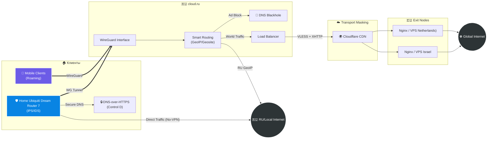

Я реализую проект-концепцию защищенной оверлейной сети с некоторым уклоном в сторону SD-WAN. В отличие от обычного VPN, где весь трафик заворачивается в одну трубу, я использую гибридную схему с балансировкой и PBR. Трафик классифицируется на уровне домашнего роутера и хаба, выбирая оптимальный маршрут.

Топология сети

Ключевые компоненты и защита

Периметр
Ubiquiti Dream Router 7 (UDR7): Пограничный шлюз дома с настроенным PBR.
Сегментация: IoT-устройства изолированы в отдельный VLAN и не имеют доступа к оверлейной сети.
Для корректной работы PBR UDR7 должен выступать DNS сервером для клиентов, upstream DNS я использую Control D с DoH. 

Мобильные клиенты должны иметь возможность подключиться к узлу cloud.ru из любой сети.

Агрегация
Центральный узел в cloud.ru.
Протокол: WireGuard выбран для связи "Клиент-Хаб" из-за минимальной нагрузки на батарею мобильных устройств и штатной работы на UDR7.
Логика маршрутизации:
GeoIP: RU → Direct Connection (Прямой доступ к РФ ресурсам).
Category: Ads/Trackers → Blackhole (Режет рекламу).
Default Route → Secure Tunnel (Весь остальной трафик уходит на другие ноды).

Маскировка
Для прохода через DPI используется VLESS протокол с мимкрией по обычный HTTPS.
Transport: VLESS + XHTTP. Трафик упаковывается в валидные HTTP/2 запросы, неотличимые от загрузки контента.
CDN Cloaking: Cloudflare CDN скрывает реальные IP-адреса конечных серверов.
Encryption: Полный TLS 1.2 Handshake с валидными сертификатами (имитация веб-серфинга).

Защита инфраструктуры

Проект реализует жесткие меры безопасности для минимизации поверхности атаки на публичных узлах.

OS & Network Level
SSH Hardening
    * Аутентификация только по Ed25519 ключам (используется по умолчанию в cloud.ru, для остальных провайдеров необходимо доработать).
    * Запрет входа под `root` (используется по умолчанию в cloud.ru, для остальных провайдеров необходимо доработать).
Firewall (UFW):
    * Политика Default Deny Incoming (включена по умолчанию).
    * Разрешены только необходимые порты: HTTPS (443) и UDP порт WG.
    * Доступ до 22 порта (SSH) и менеджмент порту 3x-ui закрыт WL.
Включен алгоритм `BBR` для оптимизации TCP congestion control и защиты от некоторых видов флуда.

Application Level (Xray)
Сервис Xray запускается от отдельного пользователя `uuid-service` без прав `sudo` и доступа к shell (`/sbin/nologin`).
Прокси не отвечает на невалидные запросы (Probe Resistance). Любой пакет, не прошедший проверку UUID/Auth, перенаправляется на легитимный сайт-заглушку (Fallback отдает ошибку).
Настроены `unattended-upgrades` для автоматической установки патчей безопасности ядра и пакетов ОС.

Автоматизация (Infrastructure as Code) (в доработке)
Ручная настройка серверов сведена к минимуму. Вся инфраструктура описывается кодом (Ansible).
Возможности плейбука
System Hardening: Настройка UFW по принципу "Default Deny", установка Nginx (Reverse Proxy) и панели 3x-ui с ядром xray.
Secrets Management: SSL-сертификаты и UUID не хранятся в открытом виде (используются переменные окружения).

Развертывание (в работе)
